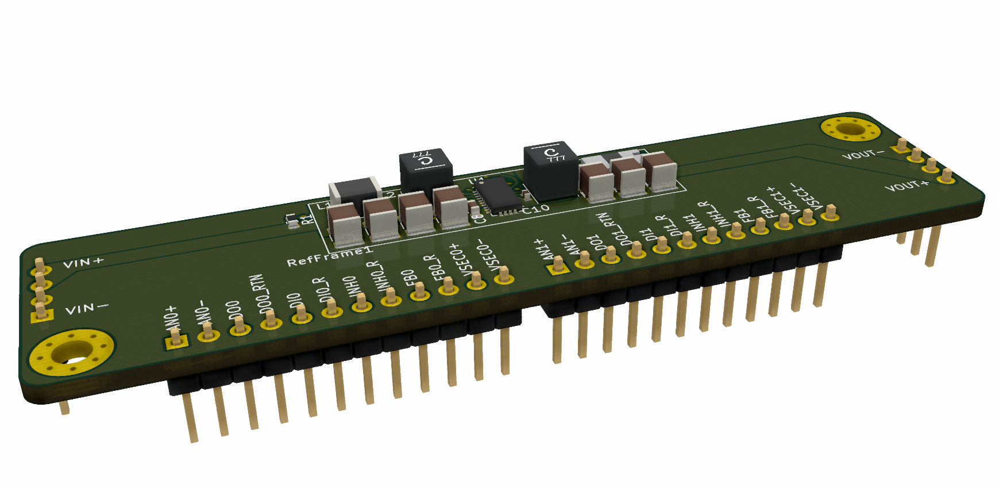
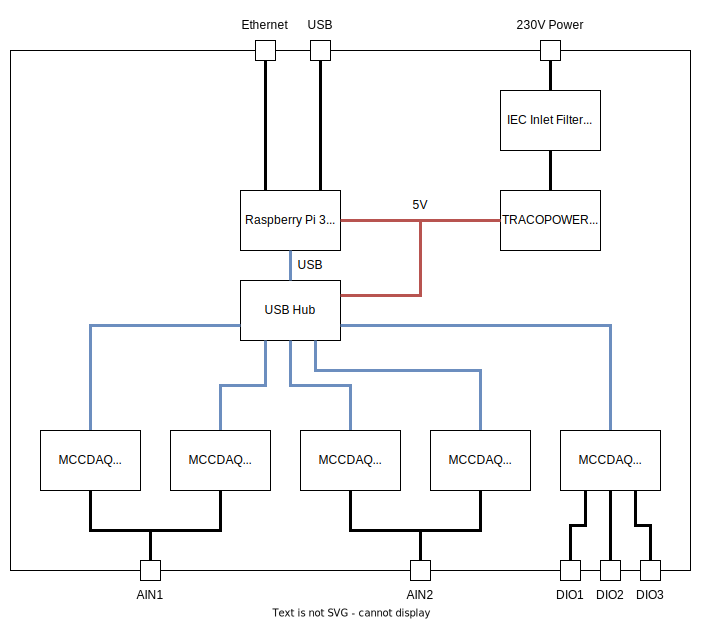

# power-controller-prototyping-example
This is the accompaning repository to the ISTS 2022 paper "Demonstration of Efficient Aerospace Power Controller Prototyping on the DLR Core Avionic Testbed".

## Evaluation Module
The Evaluation Module is a 90mm x 23mm module used at DLR Institute of Space Systems to streamline the power controller development process. It can be used stand-alone for functional and performance testing of mostly single-function circuits, but also together with the Modular Breadboard setup to form fully functional power controller prototypes.

You find here the KiCad 6 template of the Evaluation Module Formfactor. To use it simple copy the folder to your KiCad 6 template folder and use the dialog "New Project from Template..." dialog.

Following signals are assumed to be routed to the headers:

| Pin Name | Function |
| --- | --- |
| ANx+ | Differential Analog Signal positive |
| ANx- | Differential Analog Signal negative |
| DOx | Digital Output |
| DOx_RTN | Digital Output Return |
| DIx | Digital Input |
| DIx_RTN | Digital Input Return |
| INHx | Inhibit Input |
| INHx_RTN | Inhibit Input Return |
| FBx | Analog/Digital Feedback Input |
| FBx_RTN | Feedback Return |
| VSECx+ | Secondary Voltage Supply positive |
| VSECx- | Secondary Voltage Supply negative |

To perform measurements on the Evaluation Modules there is an Evaluation Module Measurement Adapter board, that breaks out the pin headers to banana jacks or screw terminals for the input and output, and to pin headers or screw terminals for the measurement and control signals.

## Modular Breadboard
You can find here the KiCad design files for the Modular Breadboard and the Breakout Board. Please be aware that prototypes of the boards based on the KiCad files have not been produced and tested yet. The hardware demonstrated in the paper is based on a previous version made with Altium Designer.

## TMTC Simulator
To control the Modular Breadboard with all its Evaluation Modules, we are using the so called TMTC Simulator. This equipment consists of a Raspberrry Pi single board computer with 4 USB analog data acquisition boards and one USB digital IO board.

